---
## Author
author:
  name: Савенкова Татьяна Александровна
  degrees: DSc
  orcid: 0000-0002-0877-7063
  email: 1032253537@rudn.ru
  affiliation:
    - name: Российский университет дружбы народов
      country: Российская Федерация
      postal-code: 117198
      city: Москва
      address: ул. Миклухо-Маклая, д. 6

## Title
title: "Лабораторная работа №4"
subtitle: "дисциплина: Архитектура компьютеров"
license: "CC BY"
---

# Цель работы

Целью данной работы является приобретение практических навыков установки операционной системы на виртуальную машину, настройки минимально
необходимых для дальнейшей работы сервисов.

# Задание

* Установка Linux на Qemu
* Установка необходимого ПО
* Первоначальная настройка ОС для дальнейшей работы

# Теоретическое введение

QEMU — свободная программа с открытым исходным кодом для эмуляции
аппаратного обеспечения различных платформ.
Включает в себя эмуляцию процессоров Intel x86 и устройств ввода-вывода.
Может эмулировать 80386, 80486, Pentium, Pentium Pro, AMD64 и другие x86-
совместимые процессоры; ARM, MIPS, RISC-V, PowerPC, SPARC, SPARC64 и частично m68k.
Работает на Syllable, FreeBSD, OpenBSD, FreeDOS, Linux, Windows 9x, Windows
2000, Mac OS X, QNX[8][9][10], Android и др.

# Выполнение лабораторной работы

Захожу в виртуальную машину и создаю операционную систему ([рис. @fig-001])

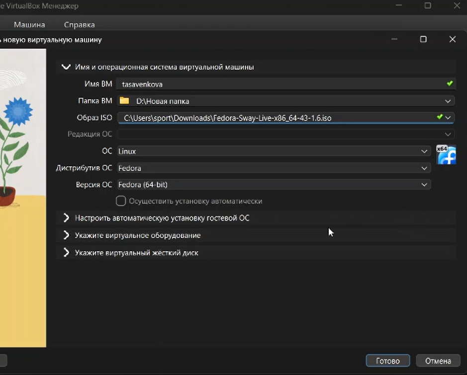{#fig-001 width=70%}

Настраиваю память ([рис. @fig-002])

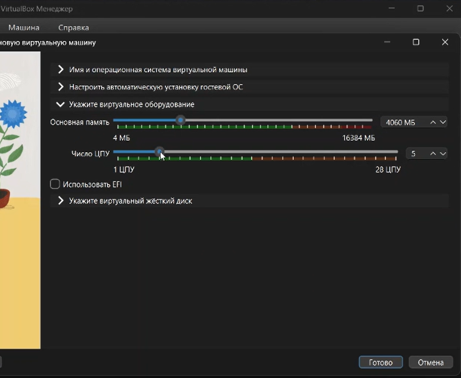{#fig-002 width=70%}

Устанавливаю Fedora Linux 43 Sway ([рис. @fig-003])

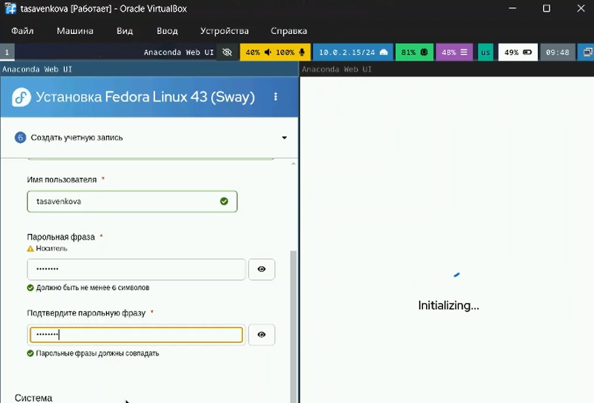{#fig-003 width=70%}

После установки скачиваю набор необходимых пакетов для работы с ОС. ([рис. @fig-004])

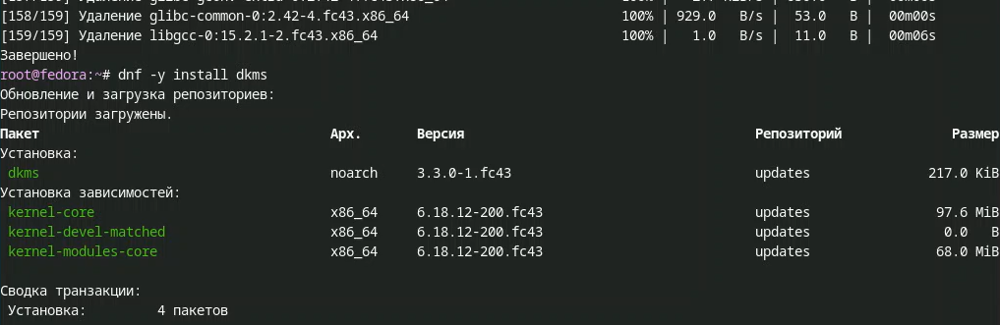{#fig-004 width=70%}

Запускаю скрипт для автоматического обновления пакетов через пакетный
менеджер dnf. ([рис. @fig-005])

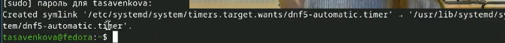{#fig-005 width=70%}

Отключаю защиту SELinux, так как на данном курсе мы не будем рассматривать
работу с ней. ([рис. @fig-006])

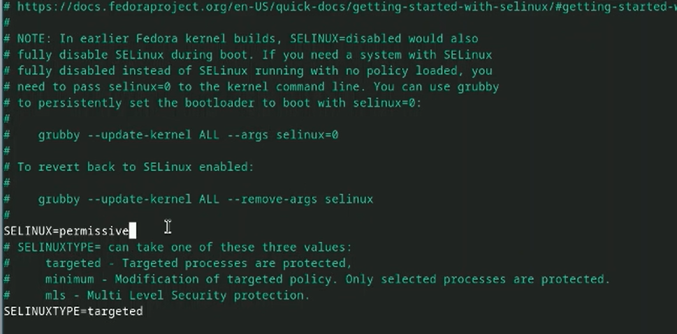{#fig-006 width=70%}

Настраиваю xkb, добавляю вторую раскладку клавиатуры с русским языком и
задаю переключение на right ctrl. ([рис. @fig-007])

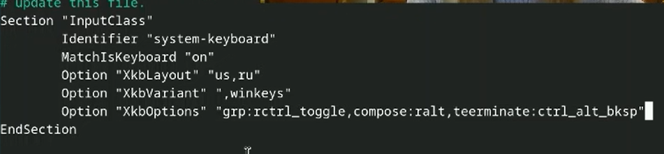{#fig-007 width=70%}

Проверяю корректность заданного имени для hostname. ([рис. @fig-008])

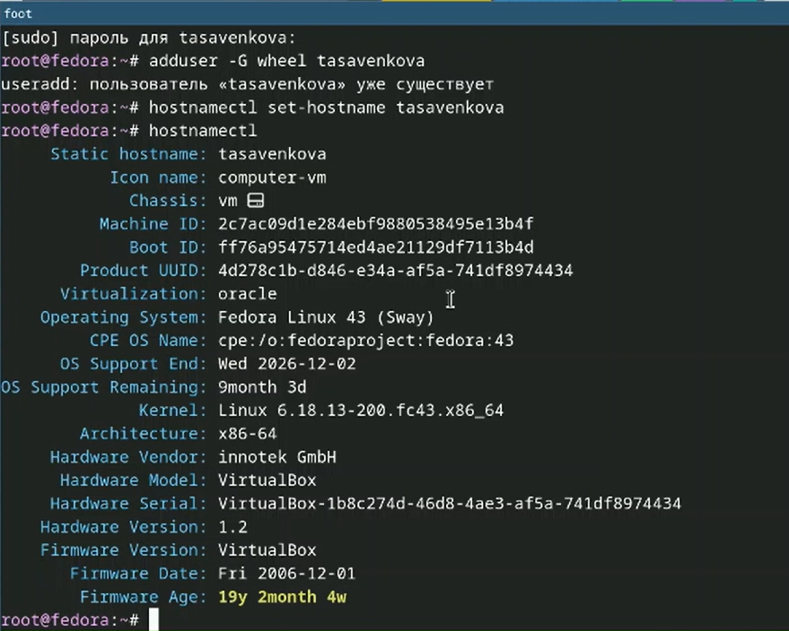{#fig-008 width=70%}

Устанавливаю pandoc, pandoc-crossref, texlive для работы над отчетами для
лабораторных работ. ([рис. @fig-009])

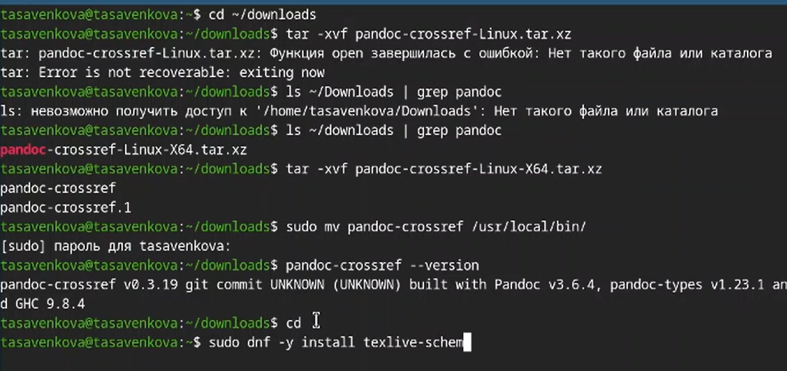{#fig-009 width=70%}

# Домашнее задание

Проверяю последовательность загрузки графического окружения командой
dmesg | grep -i с указанием вывода желаемого нахождения ([рис. @fig-010])

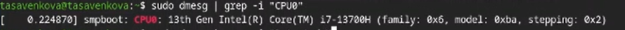{#fig-010 width=70%}

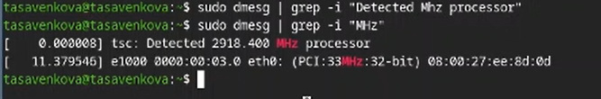{#fig-011 width=70%}

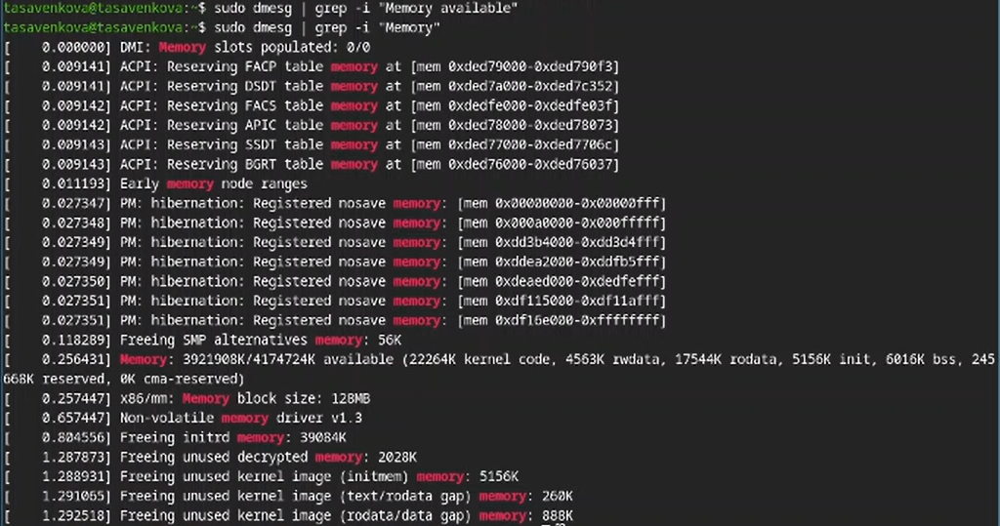{#fig-012 width=70%}

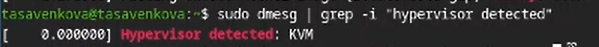{#fig-013 width=70%}

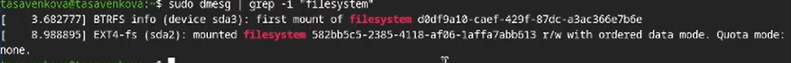{#fig-014 width=70%}

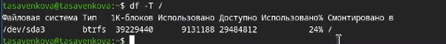{#fig-015 width=70%}

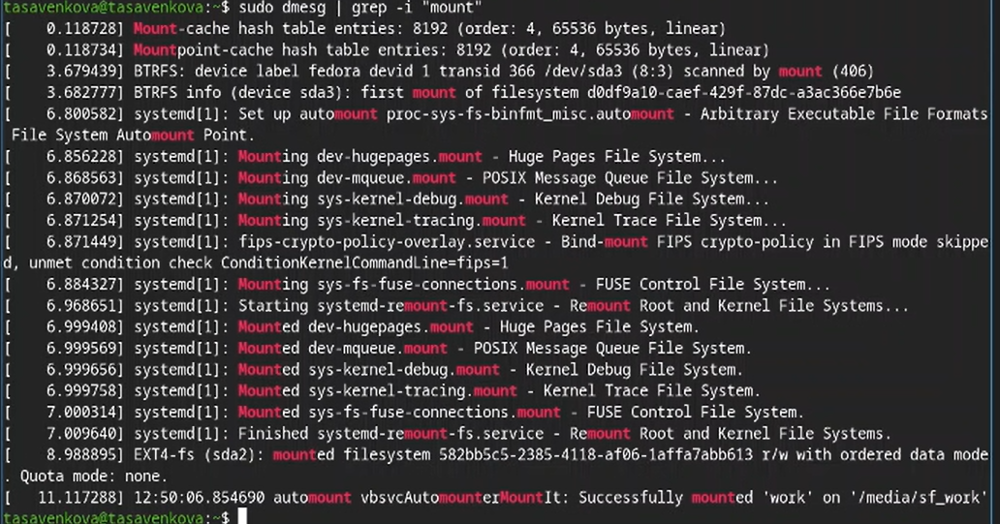{#fig-016 width=70%}

# Выводы

В ходе выполнения лабораторный работы прибрела навыки установки виртуальной машины на Qemu, установила ряд пакетов и настроила ОС для дальнейшей работы на ней.

# Список литературы{.unnumbered}

::: {#refs}
:::
