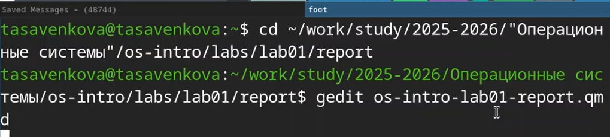
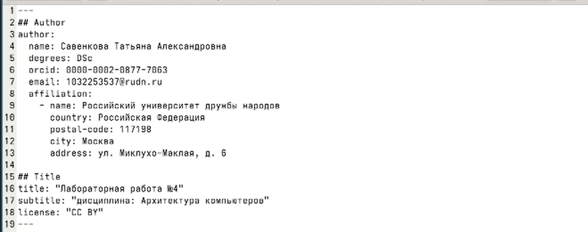
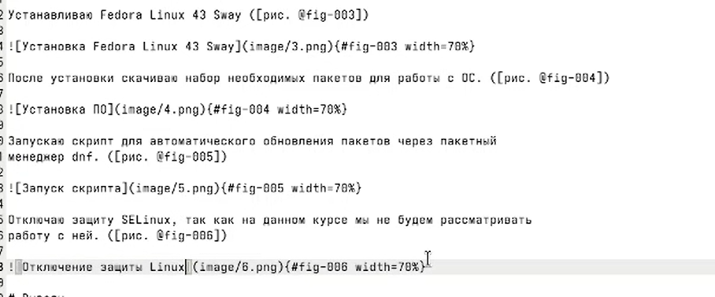
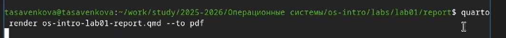

---
## Author
author:
  name: Савенкова Татьяна Александровна
  degrees: DSc
  orcid: 0000-0002-0877-7063
  email: 1032253537@rudn.ru
  affiliation:
    - name: Российский университет дружбы народов
      country: Российская Федерация
      postal-code: 117198
      city: Москва
      address: ул. Миклухо-Маклая, д. 6

## Title
title: "Лабораторная работа №3"
subtitle: "дисциплина: Архитектура компьютеров"
license: "CC BY"
---

# Цель работы

Научиться оформлять отчёты с помощью легковесного языка разметки
Markdown.

# Задание

* Сделайте отчёт по предыдущей лабораторной работе в формате Markdown.
* В качестве отчёта просьба предоставить отчёты в 3 форматах: pdf, docx и
md (в архиве, поскольку он должен содержать скриншоты, Makefile и т.д.)

# Теоретическое введение

Чтобы создать заголовок, используйте знак ( # ). Чтобы задать для текста полужирное начертание, заключите его в двойные звездочки. Чтобы задать для текста
курсивное начертание, заключите его в одинарные звездочки. Чтобы задать для
текста полужирное и курсивное начертание, заключите его в тройные звездочки.
Блоки цитирования создаются с помощью символа >. Неупорядоченный (маркированный) список можно отформатировать с помощью звез- дочек или тире.
Чтобы вложить один список в другой, добавьте отступ для элементов дочернего
списка. Упорядоченный список можно отформатировать с помощью соответствующих цифр. Чтобы вложить один список в другой, добавьте отступ для элементов
дочернего списка. Синтаксис Markdown для встроенной ссылки состоит из части
[link text] , представ- ляющей текст гиперссылки, и части (file-name.md) – URLадреса или имени файла, на который дается ссылка. Markdown поддерживает
как встраивание фрагментов кода в предложение, так и их размещение между
предложениями в виде отдельных огражденных блоков. Огражденные блоки
кода — это простой способ выделить синтаксис для фрагментов кода. Внутритекстовые формулы делаются аналогично формулам LaTeX. Для обработки файлов в
формате Markdown будем использовать Pandoc. Конкретно, нам понадобится программа pandoc , pandoc-citeproc https://github.com/jgm/pandoc/releases, pandoccrossref https://github.com/lierdakil/pandoc-crossref/releases. Преобразовать файл
README.md можно следующим образом: 1 pandoc README.md -o README.pdf
или так 1 pandoc README.md -o README.docx Можно использовать следующий
Makefile 1 FILES = $(patsubst %.md, %.docx, $(wildcard .md)) 2 FILES += $(patsubst %.md,%.pdf, $(wildcard .md))

# Выполнение лабораторной работы

В рабочей директории курса открываю через текстовый редактор файл с шаблоном отчета. ([рис.  @fig-001])

{#fig-001 width=70%}

Указываю основную информацию о лабораторной работе. ([рис. @fig-002])

{#fig-002 width=70%}

Вставляю картинки и подписываю их. ([рис. @fig-003])

{#fig-003 width=70%}

Конвертирую из qmd в другие форматы ([рис. @fig-004])

{#fig-004 width=70%}

# Выводы

В ходе выполнения данной лабораторной работы я научилась оформлять отчёты
с помощью легковесного языка разметки Markdown.

# Список литературы{.unnumbered}

::: {#refs}
:::
