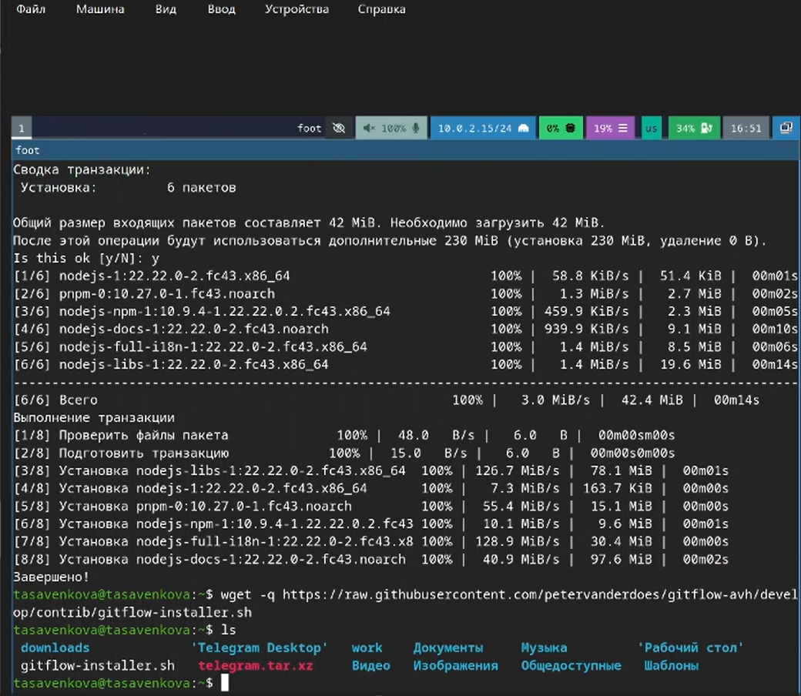
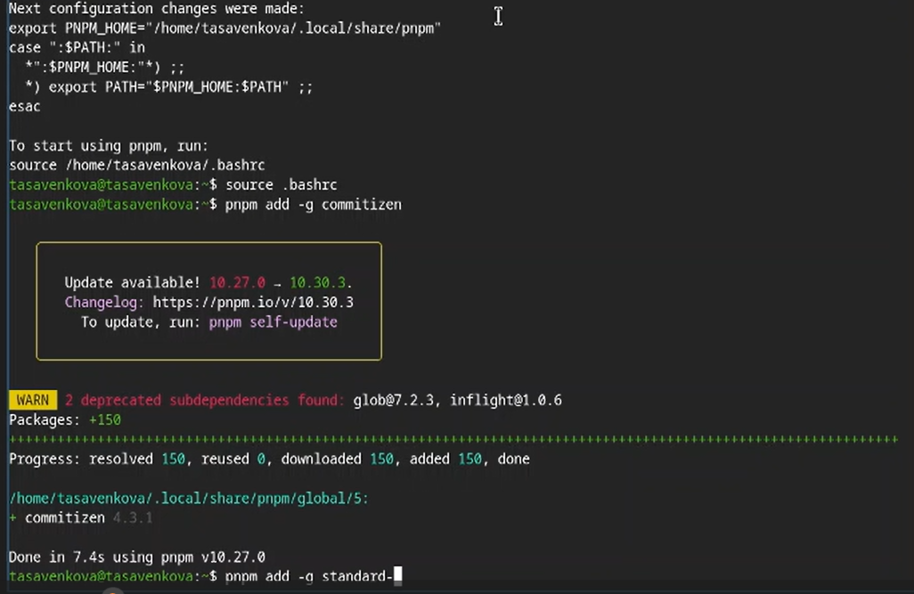
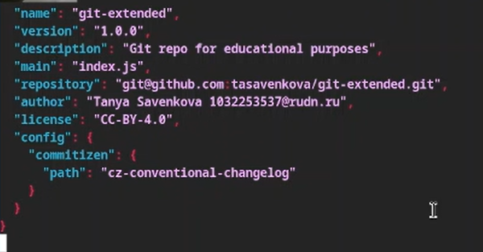
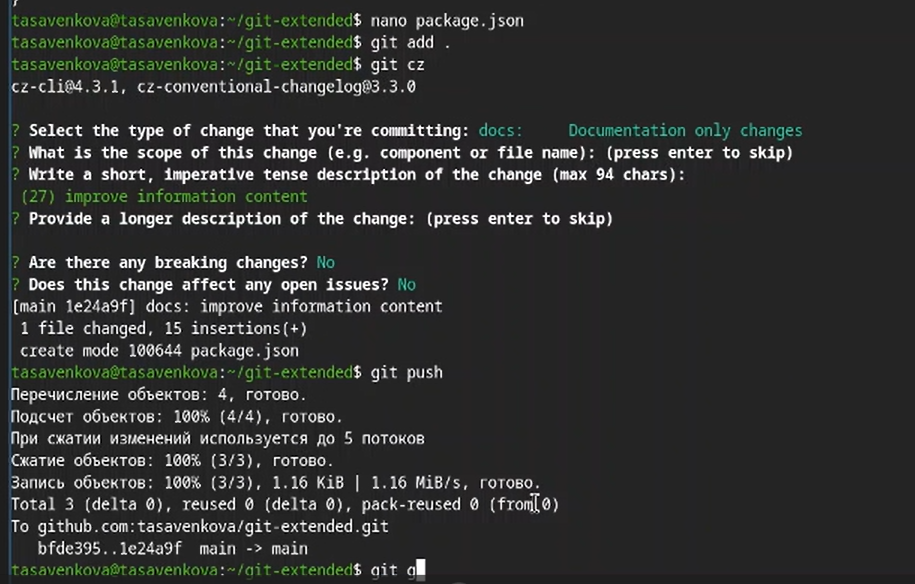
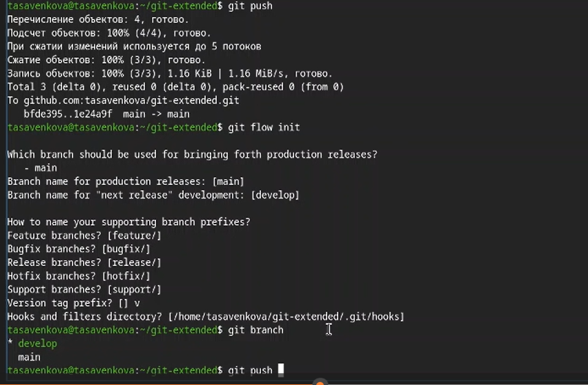
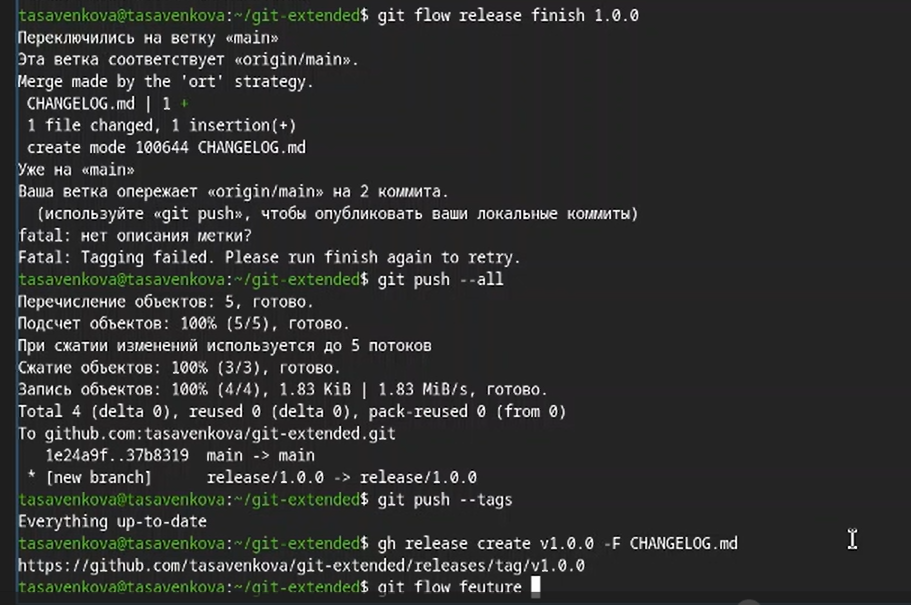
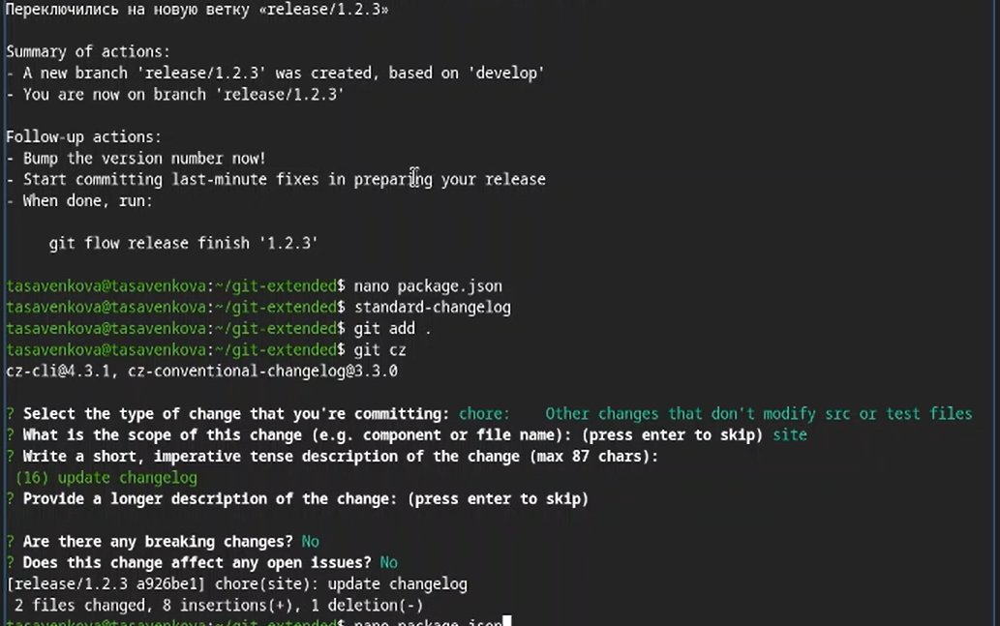

---
## Front matter
lang: ru-RU
title: Лабораторная работа №4
subtitle: Операционные системы
author:
  - Савенкова Татьяна
institute:
  - Российский университет дружбы народов, Москва, Россия
date: 02 марта 2026

## i18n babel
babel-lang: russian
babel-otherlangs: english

## Formatting pdf
toc: false
toc-title: Содержание
slide_level: 2
aspectratio: 169
section-titles: true
theme: metropolis
header-includes:
  - \metroset{progressbar=frametitle,sectionpage=progressbar,numbering=fraction}

## Fonts
mainfont: "Liberation Serif"
sansfont: "Liberation Sans"
monofont: "Liberation Mono"
mathfont: "Liberation Sans"
---

# Информация

## Докладчик

:::::::::::::: {.columns align=center}
::: {.column width="70%"}

  * Савенкова Татьяна Александровна
  * Студент НКАбд-05-25
  * я Таня
  * Российский университет дружбы народов
  * [1032253537@pfur.ru](mailto:1032253537@pfur.ru)

:::
::: {.column width="30%"}

:::
::::::::::::::

# Цель работы

Получение навыков правильной работы с репозиториями git.

# Задание

* Выполнить работу для тестового репозитория.
* Преобразовать рабочий репозиторий в репозиторий с git-flow и conventional commits.

# Теоретическое введение

Общая информация

    Gitflow Workflow опубликована и популяризована Винсентом Дриссеном.
    Gitflow Workflow предполагает выстраивание строгой модели ветвления с учётом выпуска проекта.
    Данная модель отлично подходит для организации рабочего процесса на основе релизов.
    Работа по модели Gitflow включает создание отдельной ветки для исправлений ошибок в рабочей среде.
    Последовательность действий при работе по модели Gitflow:
        Из ветки master создаётся ветка develop.
        Из ветки develop создаётся ветка release.
        Из ветки develop создаются ветки feature.
        Когда работа над веткой feature завершена, она сливается с веткой develop.
        Когда работа над веткой релиза release завершена, она сливается в ветки develop и master.
        Если в master обнаружена проблема, из master создаётся ветка hotfix.
        Когда работа над веткой исправления hotfix завершена, она сливается в ветки develop и master.

Процесс работы с Gitflow

    Основные ветки (master) и ветки разработки (develop)
        Для фиксации истории проекта в рамках этого процесса вместо одной ветки master используются две ветки. В ветке master хранится официальная история релиза, а ветка develop предназначена для объединения всех функций. Кроме того, для удобства рекомендуется присваивать всем коммитам в ветке master номер версии.

        При использовании библиотеки расширений git-flow нужно инициализировать структуру в существующем репозитории:

        git flow init

        Для github параметр Version tag prefix следует установить в v.

        После этого проверьте, на какой ветке Вы находитесь:

        git branch

    Функциональные ветки (feature)
        Под каждую новую функцию должна быть отведена собственная ветка, которую можно отправлять в центральный репозиторий для создания резервной копии или совместной работы команды. Ветки feature создаются не на основе master, а на основе develop. Когда работа над функцией завершается, соответствующая ветка сливается обратно с веткой develop. Функции не следует отправлять напрямую в ветку master.
        Как правило, ветки feature создаются на основе последней ветки develop.

        Создание функциональной ветки

            Создадим новую функциональную ветку:

            git flow feature start feature_branch

            Далее работаем как обычно.

        Окончание работы с функциональной веткой

            По завершении работы над функцией следует объединить ветку feature_branch с develop:

            git flow feature finish feature_branch

    Ветки выпуска (release)
        Когда в ветке develop оказывается достаточно функций для выпуска, из ветки develop создаётся ветка release. Создание этой ветки запускает следующий цикл выпуска, и с этого момента новые функции добавить больше нельзя — допускается лишь отладка, создание документации и решение других задач. Когда подготовка релиза завершается, ветка release сливается с master и ей присваивается номер версии. После нужно выполнить слияние с веткой develop, в которой с момента создания ветки релиза могли возникнуть изменения.
        Благодаря тому, что для подготовки выпусков используется специальная ветка, одна команда может дорабатывать текущий выпуск, в то время как другая команда продолжает работу над функциями для следующего.

        Создать новую ветку release можно с помощью следующей команды:

        git flow release start 1.0.0

        Для завершения работы на ветке release используются следующие команды:

        git flow release finish 1.0.0
        
        
Ветки исправления (hotfix)
        Ветки поддержки или ветки hotfix используются для быстрого внесения исправлений в рабочие релизы. Они создаются от ветки master. Это единственная ветка, которая должна быть создана непосредственно от master. Как только исправление завершено, ветку следует объединить с master и develop. Ветка master должна быть помечена обновлённым номером версии.
        Наличие специальной ветки для исправления ошибок позволяет команде решать проблемы, не прерывая остальную часть рабочего процесса и не ожидая следующего цикла релиза.

        Ветку hotfix можно создать с помощью следующих команд:

        git flow hotfix start hotfix_branch

        По завершении работы ветка hotfix объединяется с master и develop:

        git flow hotfix finish hotfix_branch
        
# Выполнение лабораторной работы

Устанавливаю nodejs, пакетный менеджер для него pnpm и gitflow.([рис. @fig-001]).

{#fig-001 width=70%}

Устаналиваю через pnpm commitizen и standard-changelog. ([рис. @fig-002])

{#fig-002 width=70%}

Создаю новый репозиторий и делаю там первый коммит. ([рис. @fig-003])

{#fig-003 width=70%}

Инициализирую и конфигурирую общепринятые коммиты в созданной директории через редактирование package.json. ([рис. @fig-004])

{#fig-004 width=70%}

Делаю снимок изменений, создаю коммит и отправляю на удаленный репозиторий. ([рис @fig-005])

{#fig-005 width=70%}

Инициализирую в репозитории git flow и создаю 1 релиз в только что созданной
ветке develop. ([рис. @fig-006])

{#fig-006 width=70%}

Создаю список изменений через standard changelog, заканчиваю релиз и выгружаю на удаленный репозиторий изменения. ([рис. @fig-007])

{#fig-007 width=70%}

Инициализирую ветку feature для работы над новой функциональностью, готовлю релиз и загружаю на github. ([рис.@fig-008])

{#fig-008 width=70%}

# Выводы

В ходе выполнения лабораторный работы я получила навыки правильной работы с репозиториями git

:::
