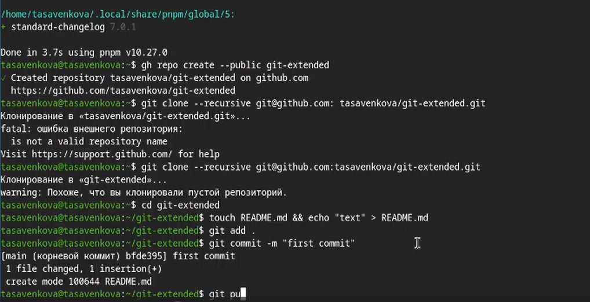

# Лабораторная работа №4
Савенкова Татьяна Александровна

-   [1 Цель
    работы](#цель-работы)
-   [2 Задание](#задание)
-   [3 Теоретическое
    введение](#теоретическое-введение)
-   [4 Выполнение лабораторной
    работы](#выполнение-лабораторной-работы)
-   [5 Выводы](#выводы)
-   [Список литературы](#список-литературы)

# Цель работы

Получение навыков правильной работы с репозиториями git.

# Задание

-   Выполнить работу для тестового репозитория.
-   Преобразовать рабочий репозиторий в репозиторий с git-flow и
    conventional commits.

# Теоретическое введение

Общая информация

    Gitflow Workflow опубликована и популяризована Винсентом Дриссеном.
    Gitflow Workflow предполагает выстраивание строгой модели ветвления с учётом выпуска проекта.
    Данная модель отлично подходит для организации рабочего процесса на основе релизов.
    Работа по модели Gitflow включает создание отдельной ветки для исправлений ошибок в рабочей среде.
    Последовательность действий при работе по модели Gitflow:
        Из ветки master создаётся ветка develop.
        Из ветки develop создаётся ветка release.
        Из ветки develop создаются ветки feature.
        Когда работа над веткой feature завершена, она сливается с веткой develop.
        Когда работа над веткой релиза release завершена, она сливается в ветки develop и master.
        Если в master обнаружена проблема, из master создаётся ветка hotfix.
        Когда работа над веткой исправления hotfix завершена, она сливается в ветки develop и master.

Процесс работы с Gitflow

    Основные ветки (master) и ветки разработки (develop)
        Для фиксации истории проекта в рамках этого процесса вместо одной ветки master используются две ветки. В ветке master хранится официальная история релиза, а ветка develop предназначена для объединения всех функций. Кроме того, для удобства рекомендуется присваивать всем коммитам в ветке master номер версии.

        При использовании библиотеки расширений git-flow нужно инициализировать структуру в существующем репозитории:

        git flow init

        Для github параметр Version tag prefix следует установить в v.

        После этого проверьте, на какой ветке Вы находитесь:

        git branch

    Функциональные ветки (feature)
        Под каждую новую функцию должна быть отведена собственная ветка, которую можно отправлять в центральный репозиторий для создания резервной копии или совместной работы команды. Ветки feature создаются не на основе master, а на основе develop. Когда работа над функцией завершается, соответствующая ветка сливается обратно с веткой develop. Функции не следует отправлять напрямую в ветку master.
        Как правило, ветки feature создаются на основе последней ветки develop.

        Создание функциональной ветки

            Создадим новую функциональную ветку:

            git flow feature start feature_branch

            Далее работаем как обычно.

        Окончание работы с функциональной веткой

            По завершении работы над функцией следует объединить ветку feature_branch с develop:

            git flow feature finish feature_branch

    Ветки выпуска (release)
        Когда в ветке develop оказывается достаточно функций для выпуска, из ветки develop создаётся ветка release. Создание этой ветки запускает следующий цикл выпуска, и с этого момента новые функции добавить больше нельзя — допускается лишь отладка, создание документации и решение других задач. Когда подготовка релиза завершается, ветка release сливается с master и ей присваивается номер версии. После нужно выполнить слияние с веткой develop, в которой с момента создания ветки релиза могли возникнуть изменения.
        Благодаря тому, что для подготовки выпусков используется специальная ветка, одна команда может дорабатывать текущий выпуск, в то время как другая команда продолжает работу над функциями для следующего.

        Создать новую ветку release можно с помощью следующей команды:

        git flow release start 1.0.0

        Для завершения работы на ветке release используются следующие команды:

        git flow release finish 1.0.0

    Ветки исправления (hotfix)
        Ветки поддержки или ветки hotfix используются для быстрого внесения исправлений в рабочие релизы. Они создаются от ветки master. Это единственная ветка, которая должна быть создана непосредственно от master. Как только исправление завершено, ветку следует объединить с master и develop. Ветка master должна быть помечена обновлённым номером версии.
        Наличие специальной ветки для исправления ошибок позволяет команде решать проблемы, не прерывая остальную часть рабочего процесса и не ожидая следующего цикла релиза.

        Ветку hotfix можно создать с помощью следующих команд:

        git flow hotfix start hotfix_branch

        По завершении работы ветка hotfix объединяется с master и develop:

        git flow hotfix finish hotfix_branch

# Выполнение лабораторной работы

Устанавливаю nodejs, пакетный менеджер для него pnpm и
gitflow.(<a href="#fig-001" class="quarto-xref">рис. 1</a>).

Устаналиваю через pnpm commitizen и standard-changelog.
(<a href="#fig-002" class="quarto-xref">рис. 2</a>)

Создаю новый репозиторий и делаю там первый коммит.
(<a href="#fig-003" class="quarto-xref">рис. 3</a>)

Инициализирую и конфигурирую общепринятые коммиты в созданной директории
через редактирование package.json.
(<a href="#fig-004" class="quarto-xref">рис. 4</a>)

Делаю снимок изменений, создаю коммит и отправляю на удаленный
репозиторий. (<a href="#fig-005" class="quarto-xref">рис 5</a>)

Инициализирую в репозитории git flow и создаю 1 релиз в только что
созданной ветке develop.
(<a href="#fig-006" class="quarto-xref">рис. 6</a>)

Создаю список изменений через standard changelog, заканчиваю релиз и
выгружаю на удаленный репозиторий изменения.
(<a href="#fig-007" class="quarto-xref">рис. 7</a>)

Инициализирую ветку feature для работы над новой функциональностью,
готовлю релиз и загружаю на github. (\[рис.@fig-008\])

# Выводы

В ходе выполнения лабораторный работы я получила навыки правильной
работы с репозиториями git

# Список литературы
