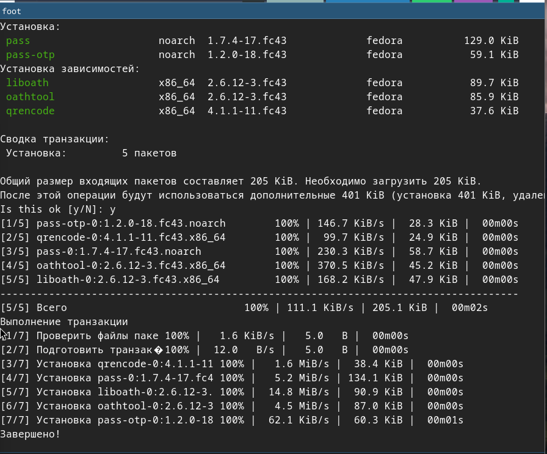
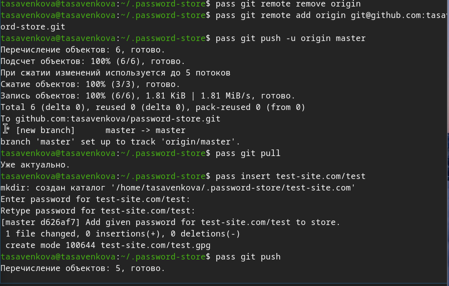
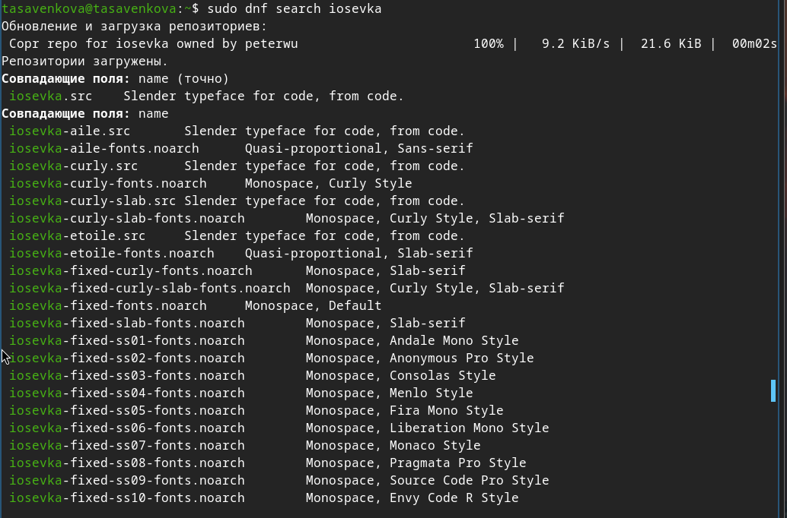
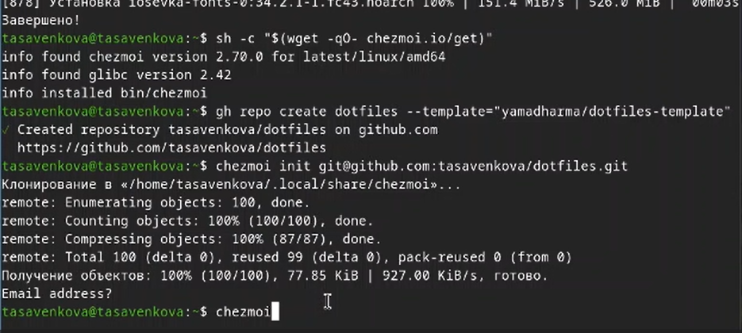
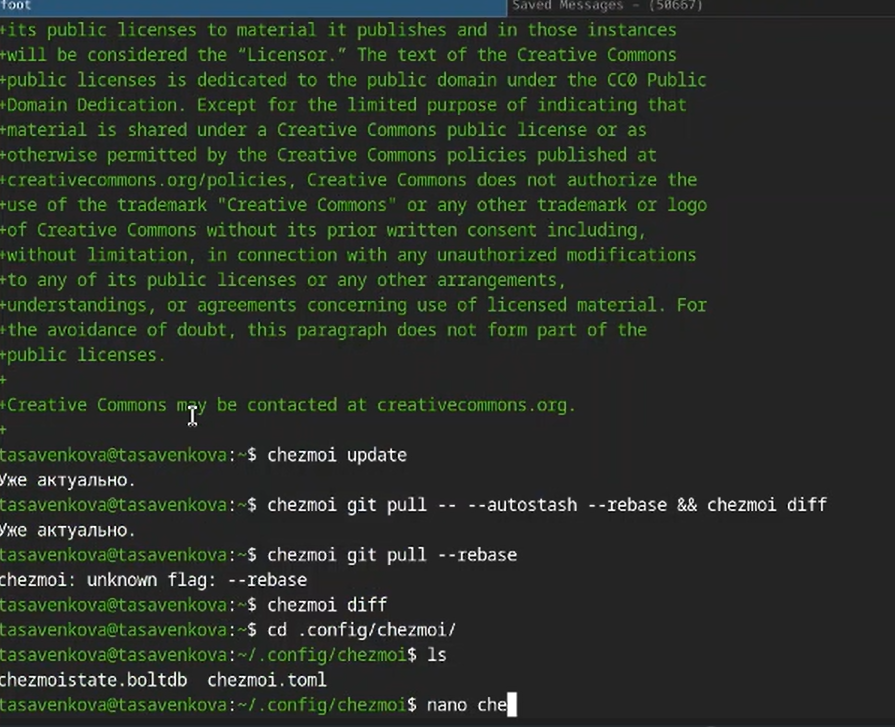
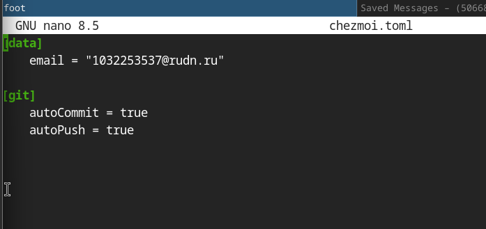

# Лабораторная работа №5
Савенкова Татьяна Александровна

-   [1 Цель
    работы](#цель-работы)
-   [2 Задание](#задание)
-   [3 Теоретическое
    введение](#теоретическое-введение)
-   [4 Выполнение лабораторной
    работы](#выполнение-лабораторной-работы)
-   [5 Выводы](#выводы)
-   [Список литературы](#список-литературы)

# Цель работы

Познакомиться с pass, gopass, native messaging, chezmoi. Научиться
пользоваться этими утилитами, синхронизировать их с гит

# Задание

1.  Установить дополнительное ПО
2.  Установить и настроить pass
3.  Настроить интерфейс с браузером
4.  Сохранить пароль
5.  Установить и настроить chezmoi
6.  Настроить chezmoi на новой машине
7.  Выполнить ежедневные операции с chezmoi

# Теоретическое введение

Менеджер паролей pass — программа, сделанная в рамках идеологии Unix.
Также носит название стандартного менеджера паролей для Unix (The
standard Unix password manager). 1.1 Основные свойства Данные хранятся в
файловой системе в виде каталогов и файлов. Файлы шифруются с помощью
GPG-ключа. 1.2 Структура базы паролей Структура базы может быть
произвольной, если Вы собираетесь использовать её напрямую, без
промежуточного программного обеспечения. Тогда семантику структуры базы
данных Вы держите в своей голове. Если же необходимо использовать
дополнительное программное обеспечение, необходимо семантику заложить в
структуру базы паролей. chezmoi используется для управления файлами
конфигурации домашнего каталога пользователя. Конфигурация chezmoi 2.2.1
Рабочие файлы Состояние файлов конфигурации сохраняется в каталоге
~/.local/share/chezmoi. Он является клоном вашего репозитория dotfiles.
Файл конфигурации ~/.config/chezmoi/chezmoi.toml (можно использовать
также JSON или YAML) специфичен для локальной машины. Файлы, содержимое
которых одинаково на всех ваших машинах, дословно копируются из
исходного каталога. Файлы, которые варьируются от машины к машине,
выполняются как шаблоны, обычно с использованием данных из файла
конфигурации локальной машины для настройки конечного содержимого,
специфичного для локальной машины.

# Выполнение лабораторной работы

Устанавливаю pass. (<a href="#fig-001" class="quarto-xref">рис. 1</a>)

Инициализирую pass на машине и делаю первый пароль.
(<a href="#fig-002" class="quarto-xref">рис. 2</a>)

Устанавливаю дополнительное ПО и
шрифты.(<a href="#fig-003" class="quarto-xref">рис. 3</a>)

Инициализирую chezmoi с указанием на указанный в лабораторной работы
репозиторий. (<a href="#fig-004" class="quarto-xref">рис. 4</a>)

Проверяю изменения в удаленном репозитории
(<a href="#fig-005" class="quarto-xref">рис. 5</a>)

Отключаю автоматические сохранение изменений.
(<a href="#fig-006" class="quarto-xref">рис. 6</a>)

# Выводы

Мы познакомились с pass, gopass, native messaging, chezmoi. Научились
пользоваться этими утилитами, синхронизировали их с гит.

# Список литературы
