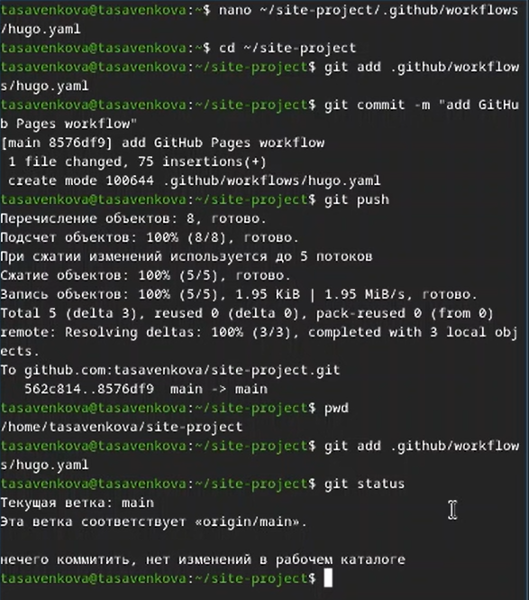

---
## Front matter
lang: ru-RU
title: Индивидуальный проект stage01
subtitle: Операционные системы
author:
  - Савенкова Татьяна
institute:
  - Российский университет дружбы народов, Москва, Россия
date: 02 марта 2026

## i18n babel
babel-lang: russian
babel-otherlangs: english

## Formatting pdf
toc: false
toc-title: Содержание
slide_level: 2
aspectratio: 169
section-titles: true
theme: metropolis
header-includes:
  - \metroset{progressbar=frametitle,sectionpage=progressbar,numbering=fraction}

## Fonts
mainfont: "Liberation Serif"
sansfont: "Liberation Sans"
monofont: "Liberation Mono"
mathfont: "Liberation Sans"
---

# Информация

## Докладчик

:::::::::::::: {.columns align=center}
::: {.column width="70%"}

  * Савенкова Татьяна Александровна
  * Студент НКАбд-05-25
  * я Таня
  * Российский университет дружбы народов
  * [1032253537@pfur.ru](mailto:1032253537@pfur.ru)

:::
::: {.column width="30%"}

:::
::::::::::::::

# Цель работы

Научиться размещать сайт на Github pages. Выполнить первый этап индивидуального проекта.

# Задание

*Установка необходимого ПО
*Скачивание шаблона темы сайта
*Размещение его на хостинге Git
*Установка параметра для URL сайта
*Размещение загатовки сайта на Github pages

# Выполнение индивидуального проекта

Устанавливаю hugo на свою виртуальную машину и переношу исполняемый
файл в директорию с пакетами. ([рис. @fig-001])

{#fig-001 width=70%}

Создаю свой репозиторий для будущего сайта, используя шаблон. ([рис. @fig-002])

{#fig-002 width=70%}

Клонирую репозиторий на свою машину и загружаю туда конфигурационный
файл для сайта. ([рис. @fig-003])

{#fig-003 width=70%}

Делаю снимок изменений, создаю коммит и отправляю изменения на github. ([рис. @fig-004])

{#fig-004 width=70%}

# Выводы

Мы научились размещать сайт на Github pages, выполнили первый этап индивидуального проекта.

:::
