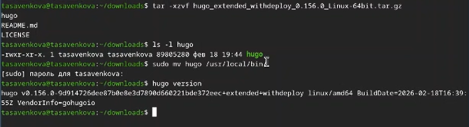
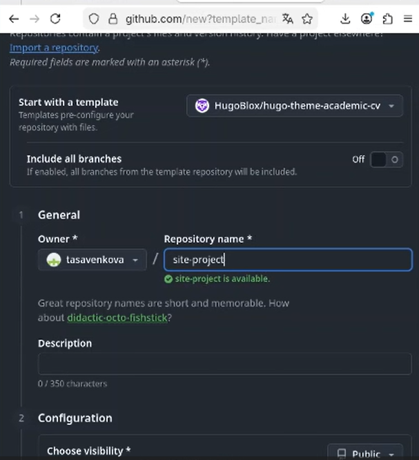
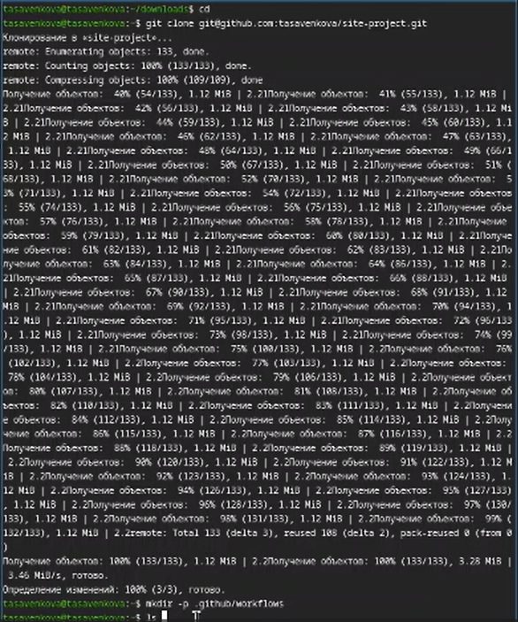

---
## Author
author:
  name: Савенкова Татьяна Александровна
  degrees: DSc
  orcid: 0000-0002-0877-7063
  email: 1032253537@rudn.ru
  affiliation:
    - name: Российский университет дружбы народов
      country: Российская Федерация
      postal-code: 117198
      city: Москва
      address: ул. Миклухо-Маклая, д. 6

## Title
title: "Индивидуальный проект 1 этап"
subtitle: "дисциплина: Архитектура компьютеров"
license: "CC BY"
---

# Цель работы

Научиться размещать сайт на Github pages. Выполнить первый этап индивидуального проекта.

# Задание

*Установка необходимого ПО
*Скачивание шаблона темы сайта
*Размещение его на хостинге Git
*Установка параметра для URL сайта
*Размещение загатовки сайта на Github pages

# Выполнение индивидуального проекта

Устанавливаю hugo на свою виртуальную машину и переношу исполняемый
файл в директорию с пакетами. ([рис. @fig-001])

{#fig-001 width=70%}

Создаю свой репозиторий для будущего сайта, используя шаблон. ([рис. @fig-002])

{#fig-002 width=70%}

Клонирую репозиторий на свою машину и загружаю туда конфигурационный
файл для сайта. ([рис. @fig-003])

{#fig-003 width=70%}

Делаю снимок изменений, создаю коммит и отправляю изменения на github. ([рис. @fig-004])

{#fig-004 width=70%}

# Выводы

Мы научились размещать сайт на Github pages, выполнили первый этап индивидуального проекта.

# Список литературы{.unnumbered}

::: {#refs}
:::
